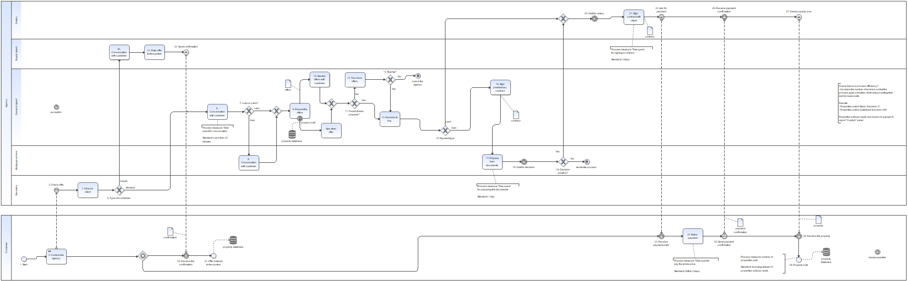

# Real Estate Agency - BPMN Process Modeling & Simulation

## 📌 Project Overview
This project demonstrates end-to-end business process modeling and simulation for a Real Estate Agency. The main goal was to map the customer journey for both demand and supply clients, run a 6-month simulation to identify process bottlenecks, and propose data-driven optimizations to increase sales and agency revenue.

## 🛠️ Tools & Technologies
* **Process Modeling:** BPMN 2.0
* **Simulation & Analysis:** iGrafx (.igx)
* **Concepts:** Process Optimization, KPIs Tracking, Resource Allocation, Business Analysis.

## 📊 The BPMN Model
Below is the mapped process, including customer, agency (demand and supply agents, secretary, mortgage advisor), and notary lanes.

## 💼 Business Scenario
The modeled agency operates Monday-Friday, handling two main types of clients:
* **Demand Customers (40%):** Searching for properties. They finance their purchase via cash (20%) or a mortgage (80%).
* **Supply Customers (60%):** Registering their properties into the agency's system.
The process handles credit advisors, property viewings, notary appointments, and edge cases (e.g., a property being sold to someone else before a viewing).

## 🚀 Process Optimization & Simulation Results (6-Month Period)
A simulation was run for a 6-month period to measure the efficiency of the "As-Is" process and compare it against an optimized "To-Be" scenario.

**Identified Bottlenecks & Actions Taken:**
The initial simulation revealed massive waiting times for clients (e.g., waiting for credit decisions or available agents). **The proposed solution was to increase the number of workers (agents and advisors)** so that the process flows smoother, drastically reducing wait times in queues.

**Key Performance Indicators (KPIs) & Business Impact:**
* **Properties Sold (Basic Scenario):** 21
* **Properties Sold (Optimized Scenario):** 289
* **Weekly Sales Volume:** ~11 properties sold per week (Optimized).
* **Estimated Monthly Commission Revenue:** **~915,166 PLN**
  *(Calculated based on 289 properties sold over 6 months, assuming an average property price of 475,000 PLN and a standard 4% agency commission).*

## 📂 Repository Structure
* `BPM_project.igx` - The original iGrafx simulation source file.
* `bpmn_model.png` - High-resolution export of the BPMN process model.
* `6Houses.pdf` - The original business requirements and constraints document.